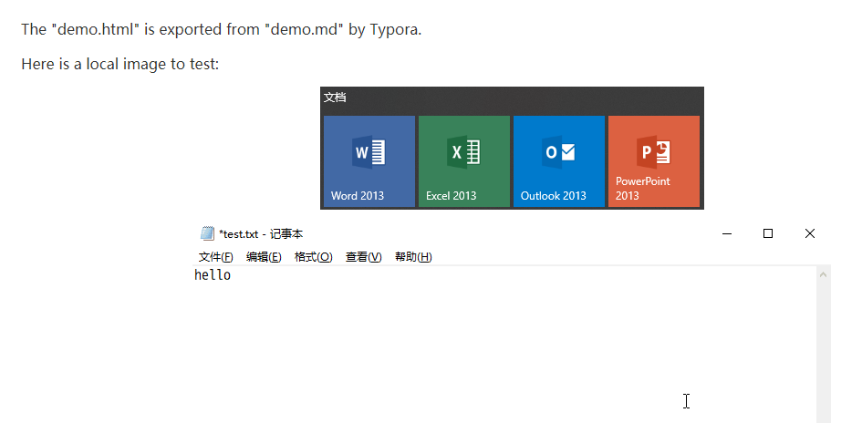

# 项目说明

我们平时将 markdown 格式导出为 html, 再将 html 另存为 mhtml 格式, 会发现原先 html 中引用的本地图片, 在 mhtml 中丢失了.

[这篇文章](https://blog.csdn.net/ybf326/article/details/84781746) 介绍了一种解决方法, 但是操作难度高, 不太实用.

本项目为解决此问题提供了更好的方案: 通过程序将 markdown 或 markdown 导出的 html 中引用的本地图片转换为 base64 格式, 并替换到原文中.

简而言之, 本项目的最终目的是, 将 markdown 及其插图 **以单个 html 完整呈现**.

演示用例 1:

1. 准备一个 markdown 文件: "examples/demo.md"
2. 用 Typora 打开它, 并导出为 html 格式到 "examples/demo.html"
3. 运行 "src/launch_gui.py" (您可以双击此文件运行)
4. 弹出可视化界面
   
5. 输入或选择 .html 文件, 点击 "Run" 按钮
6. 提示生成成功, 生成文件在 "examples/demo_base64.html"
   

演示用例 2 (不推荐):

1. 准备一个 markdown 文件: "examples/demo.md"
2. 运行 "src/markdown_base64.py"
    1. `main('../examples/demo.md', '../examples/demo_base64.md')`
3. 生成: 'examples/demo_base64.md' (可通过 markdown 编辑器打开)
    > 

演示用例 3:

1. 用 Typora 打开 "examples/demo.md"
2. 通过 Typora 导出为 html 格式到 "examples/demo.html"
3. 运行 "src/html_base64.py"
    1. `main('../examples/demo.html', '../examples/demo_base64.html')`
4. 生成: 'examples/demo_base64.html' (可通过浏览器打开)
    > 

注意: 

1. 目前仅支持对本地图片的获取和编码
2. 'src/markdown_base64.py' 不推荐使用, 因为生成的 md 文件可能过大 (体积在几 mb 时), Typora 等 markdown 编辑器无法打开, 而且用 IDE 打开也会有明显的加载时间
3. 如果使用 'src/html_base64.py', 请先将 html 与相关的本地图片放在正确的位置 (您需要保证在浏览器中打开此 html, 可以正常观看图片)

# 开发者说明

## 生成文件的体积对比

以演示用例为例, 'examples/demo.html' 大小约 18kb, 该 html 引用了两张图片的大小分别为 19kb 和 33kb.

使用浏览器的 "转换为 mhtml" 功能, 生成的 .mhtml 文件的大小为 90kb; 使用 'src/html_base64.py' 生成的 'examples/demo_base64.html' 文件的大小为 86kb.

结论:

1. 本程序生成的 base64 编码的 html 体积上比浏览器生成的 .mhtml 略小一些
2. base64 编码的 html 比原 html + 原图片的体积略大, 这是因为 base64 编码的原因 (base64 编码的图片会比原图大 1/3, 原理可上网查询)
